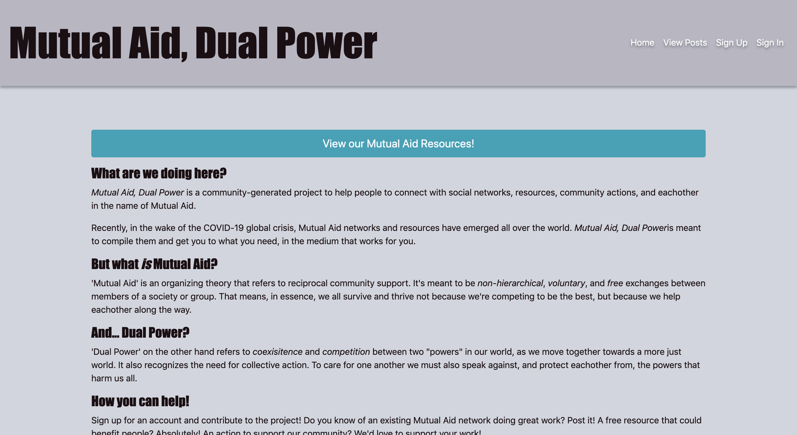
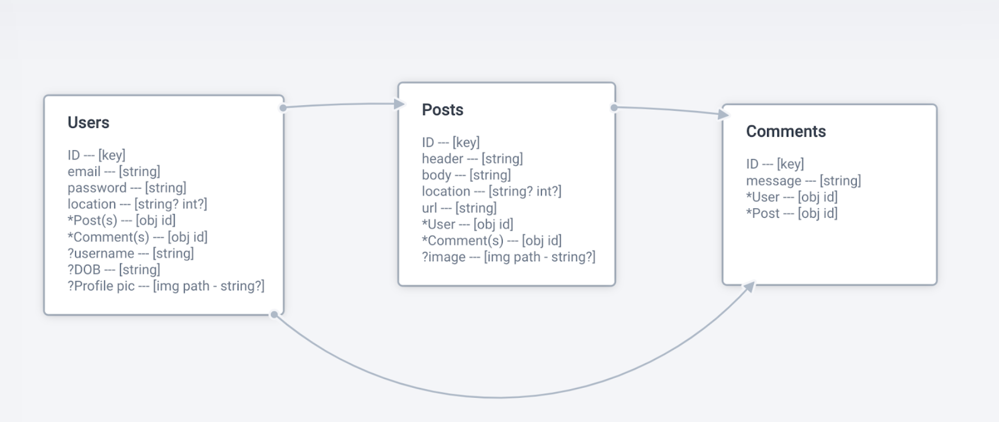

# Mutual Aid, Dual Power: Server Side

## Project Description
This project is a social networking app that is designed to support Mutual Aid network organizing efforts.  Recently, in the wake of the COVID-19 global crisis, Mutual Aid networks and resources have emerged all over the world.  However many of the networks are disconnected and there isn’t a prominent common resource connecting/compiling this information.

This app is intended to stand as a both a network in and of itself, as well as a compilation of other networks and resources to help get users connected to the resources they need, in the medium that works for them.

This repo is the custom API for this project. It presents a 'user' resource (with a unique email and hashed password) along side a 'post' resource to which registered users are able perform all CRUD actions.  Additionally all visitors to the site, regardless if they sign up for an account or not, are able to view the various posts.

The front end repo includes further detailed information on the tradition and history of the title concepts, especially in how they inform this project.

## Project Links
* [Live Site](https://srsexton94.github.io/mutualaid-client/)
* [Front End Repo](https://github.com/srsexton94/mutualaid-client)
* [Deployed Backend](https://fast-oasis-63373.herokuapp.com/)
* [Project Board](https://github.com/users/srsexton94/projects/1)

## Technologies
On the server side, the technologies used include...
* JavaScript
* Express
* MongoDB
* Mongoose
* Cors
* Passport
* Mongoose

## Dependencies (Set up & Installation)
* [GA Express Api Template](https://git.generalassemb.ly/ga-wdi-boston/express-api-template)
* [GA Express Deployment Guide](https://git.generalassemb.ly/ga-wdi-boston/express-api-deployment-guide)
* `npm install`, `-g nodemon`
* `npm run server`, starts express server
* `npm test`, runs automated tests
* `npm run debug-server`, prints extra info on whats happening
* `npm install aws-sdk`, installs aws-sdk
* `npm install dotenv`, installs dotenv
* `npm install multer`, installs multer
* [GA Express Api Deployment Guide](https://git.generalassemb.ly/ga-wdi-boston/express-api-deployment-guide)

## Planning Process
The planning process for this project's API began by outlining the User Stories (common between front and back end) and the ERD.  The ERD outlines a stretch goal resource ('comments') that at this time has not yet been implemented, but could be useful for future developement.
Additionally, though working independently, a [project board](https://github.com/users/srsexton94/projects/1) was made as a task list to track progress.

## User Stories
- As an unregistered user I want to be able to
  - view all public posts and access their content/links
  - sign up/create an account
- As a registered user I want to be able to sign in
- As a signed-in user I want to be able to...
  - sign in, update my info, & sign out
  - view all posts
  - view a specific subdivision of posts
  - view a specific post
  - create, update, and delete my own posts

## ERD

## Route Catalog

| User Routes | | |
|-------------|-|-|
| /sign-up  | POST  | CREATE |
| /sign-in  | POST  | CREATE |
| /change-password | PATCH | UPDATE |
| /sign-out  | DELETE | DESTROY |

| Post Routes | | |
|-------------|-|-|
| /posts | GET | INDEX |
| /posts/:id  | GET | SHOW |
| /posts/:id/edit | PATCH | UPDATE |
| /create-post  | POST | CREATE |
| /posts/:id | DELETE | DESTROY |

## Problem Solving
The planning of this project placed great emphasis on identifying a suitable MVP scenario, so that the details of the app's basic functionality could be realized more effectively and problems could be more easily parsed.  Additionally, utilizing the project board acted as a visualized trajectory of the project.  This helped greatly in parsing both the intent and execution of each component part of this project.
It also serves the added benefit of increasing accesibility and easing the onboarding process for any new collaborators as this project moves forward.
For the server side application in particular, utilizing postman script testing proved endlessly useful in debugging formatting and authentication errors.

## Unsolved Problems
At current publication the MVP scenario outlined below is considered successful; as is the first of the Moderate Stretch Goals (displaying posts sorted by type).

The other stretch goals have not yet been attempted and contribution is welcomed. It is vaguely intended to proceed more or less in the order presented below, but the order is flexible should reason present itself.

#### MVP
* Provide sign up/in/out and change password
* Display all posts, view a single post, update/delete your ownpost
* No bugs, alerts, refreshing, or console logs

#### Moderate Stretch Goals
* Display all posts sorted by type (tabs in wireframes)
* Sort posts by time AND location
* Add tags? Or search bar?
* Add comments resource to posts
* Update entire account information, not just password
* Add user profile pictures/photos in posts

#### Stretch "for the stars!" Goals
* Offer “forgot password?” change to un-signed in users
* Offer google/facebook authentication
* Display networks and/or offer posts on a map
